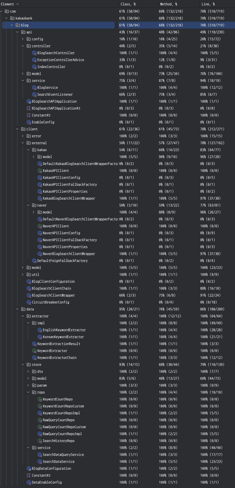
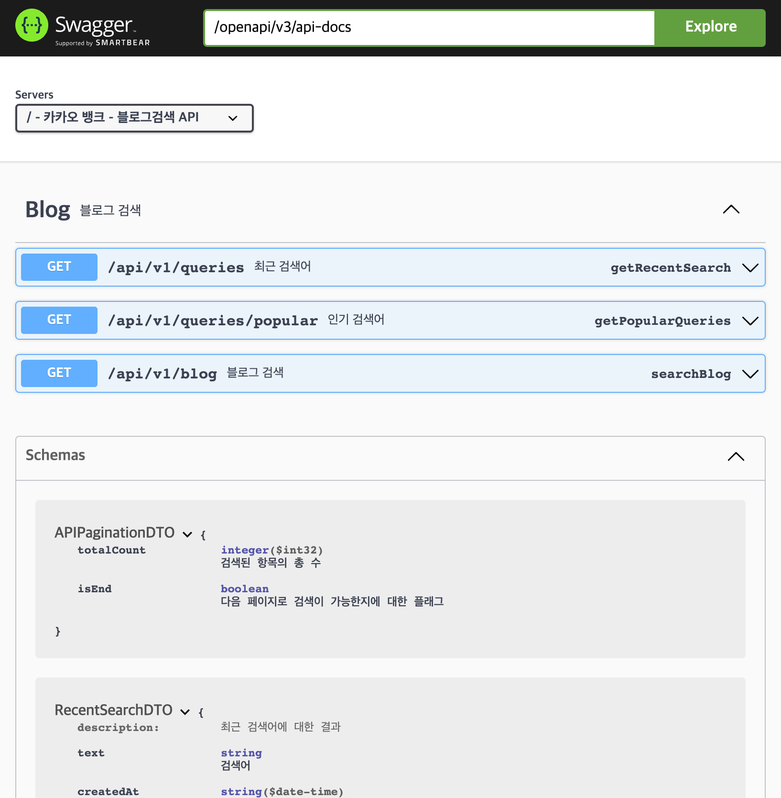
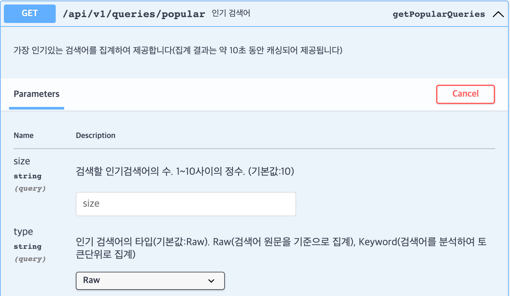
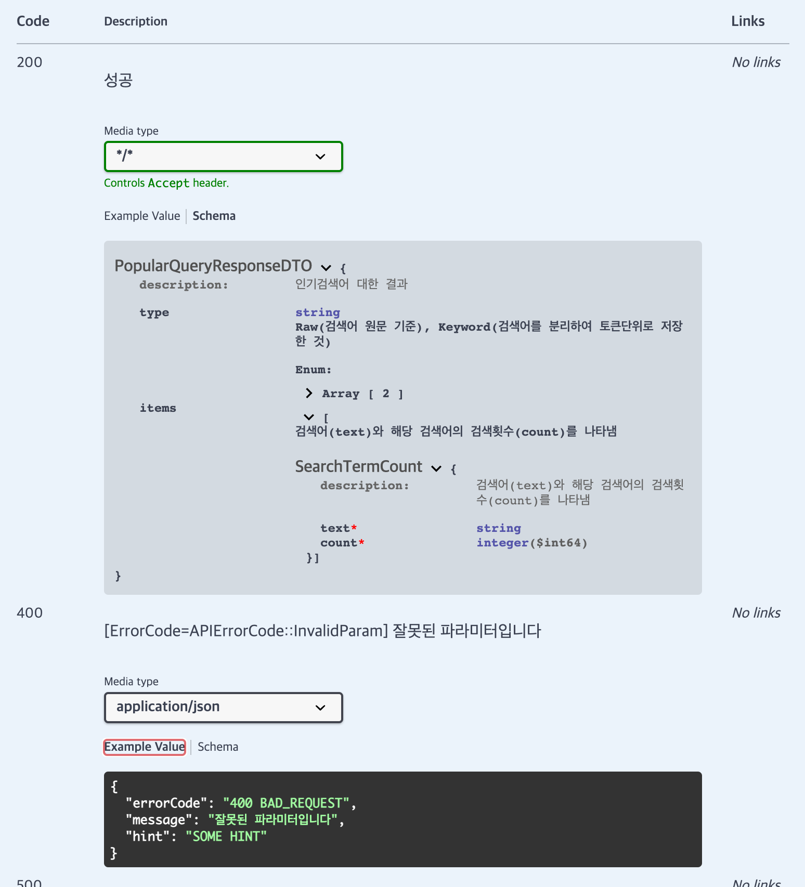

# BlogSearchAPI
국내 블로그 서비스를 검색할 수 있는 서버 프로젝트입니다. 

## 사용 기술
- Kotlin(JDK17)
- Spring Boot3
- Spring Web
  - 웹 인터페이스를 통해 사용되었습니다.
- Spring Data JPA + QueryDSL
  - 데이터베이스 접근에 사용되었습니다.
- H2 DB
  - 인메모리 DB로 사용되었습니다.
- Feign
  - 외부통신을 하는 클라이언트로 사용되었습니다.
- CircuitBreaker(Resilience4j)
  - 서킷브레이커로 장애가 지속적으로 감지 될 경우 빠른 실패(Fast fail)을 위해 사용되었습니다.
- Spring Cache + Caffeine
  - 빠른 반응성을 위하여 캐싱하는데에 사용되었습니다.
- Tokenizer(OpenKoreanText, OpennlpTools)
  - 검색어를 형태소 분석하여 명사와 명사구를 추출하는데에 사용되었습니다.


## 실행
- 리포지터리에서 직접적으로 다운로드 받거나 다음 [https://ianmk2.github.io/SomeSecretTask/api-release-1.0.0.jar](https://ianmk2.github.io/SomeSecretTask/api-release-1.0.0.jar)를 통하여 JAR파일을 준비합니다.
- 본 프로젝트는 스프링부트3.0을 사용하기 때문에 최소 JDK17이상이 설치되어 있어야 합니다.
```
java -jar api-release-1.0.0.jar
```
- 서버 구동 후, swagger를 통해 API를 체험하실 수 있습니다. 
  - http://localhost:8080/swagger-ui.html


## 요구사항 분석
- 블로그 검색
  - 외부 시스템에 의존적임
  - Fallback 기능을 구현하여 대상 서비스의 장애에 대비가 필요
  - 서킷브레이커를 통해 대상 서비스가 지속적으로 장애시 빠르게 다음 서비스로 넘기기 필요
  - 캐시를 사용하여 같은 요청에 대한 빠른 반응성이 필요

- 인기 검색어 
  - 외부서비스를 통해 검색하는 것과 검색어를 저장하는 것을 분리하여 반응성을 증대시킬 필요가 있음
  - 캐시를 사용하여 같은 요청에 대한 빠른 반응성이 필요

- 멀티 모듈 구성
  - 모듈로 분리하되, 해당 서브모듈의 확장성이 있어야 함 
  - spring boot starter 스타일의 편리한 사용성이 요구됨

- 프로젝트 검수 환경 고려
  - 빌드 된 jar, 인메모리 DB사용 등이 제약사항으로 있는 것으로 보아, 별도의 외부시스템에 대한 의존성이 없어야 할 것으로 추측
  - 단순하고 편리하게 프로젝트를 실행할 수 있도록 할 필요가 있을 것으로 추측 

  


## 설계 & 구현
2개의 서브 모듈은 메인모듈에 의존성을 갖지 않으면서 동시에 개별모듈의 확장성과 사용성 면에서 우수하도록 구현하는데에 포커스를 두고 작업하였습니다.
이 과정에서 spring 빈 형태와 import를 사용하면서도 필요한 부분에 대해서는 override가 가능하도록 하였습니다.

### 서브모듈 - BlogClient
블로그 검색 클라이언트를 담당하는 모듈입니다.
- `xxxxxAPIClient`
  - 외부 블로그 서비스의 검색을 통해 블로그 내용을 가져오는 클라이언트 구현입니다.
  - Feign과 Resilience4j를 통하여 서킷브레이커를 적용하면서도 간단하게 클라이언트를 구현하였습니다.
  - 클라이언트 사용에 필요한 API키 등은 외부에서 Bean을 통해 주입하는식으로 구현하였습니다.
- `BlogSearchClientWrapper`
  - 메인모듈에서 서비스종류에 따라 매번 다르게 요청하고 받는게 아닌, 같은 파라미터와 응답DTO로 사용할 수 있도록 각 외부서비스의 클라이언트를 감쌀수 있도록 추상화 하였습니다.
  - 만약 캐시가 주입된 경우 해당 캐시에 같은 내용의 요청에 대해서는 정해진 TTL동안 캐시가 가능하도록 구현하였습니다.
- `BlogSearchClientChain`
  - 외부 검색 서비스 장애시 클라이언트를 우선순위에 따라 자동으로 fallback시켜 동작하도록 구현하였습니다.
  - 우선순위는 ClientWrapper를 bean으로 등록시 설정한 우선순위에 따라 자동으로 설정되지만, 요청시 강제로 해당 서비스를 지정하여 요청도 가능하도록 하였습니다.
- 데이터 플로우
  - 메인모듈 <---> `BlogSearchClientChain`  <--->  `BlogSearchClientWrapper`  <--->  `xxxxxAPIClient`  <--->   외부 서비스

### 서브모듈 - BlogSearchData
검색된 검색어와 검색어에서 키워드를 추출해내고 해당 키워드도 저장하는 역할을 담당하는 모듈입니다.
- extractor/`KeywordExtractor`, `KeywordExtractorChain`
  - 어떤 문자열이 주어졌을 때 해당 문자열을 분해하여 키워드를 추출해냅니다.
  - 여러 추출기를 언어별 기능별로 구현하고 주입하여 자동으로 사용될 수 있도록 추상화하였습니다.
  - 형태소 분석 후 명사와 구를 저장합니다. 필터링이나 다른 방법도 적용할 수 있겠지만 본 과제의 핵심 주제와 거리가 있기 때문에 약식으로 구현 하였습니다.
- store/`SearchHistory` Entity
  - 유저가 검색한 내용 및 일시를 그대로 기록합니다. 이 정보를 바탕으로 '최근 검색어'기능을 제공합니다.
- store/`RawQueryCount` Entity
  - 유저가 검색한 검색어별 카운트 정보를 기록합니다. 이 정보를 바탕으로 '검색어별 인기 검색어'기능을 제공합니다.
- store/`KeywordCount` Entity
  - 유저가 검색한 검색어에서 추출한 키워드별 카운트 정보를 기록합니다. 이 정보를 바탕으로 '키워드별별 인기 검색어'기능을 제공합니다.
- 기타
  - 저장시 길이가 30자를 초과한 검색어에 대해서는 30자만큼만을 저장하도록 구현하였습니다. 통계적으로 유의미한 데이터가 아닐 것이라고 가정했기 때문입니다.

### 메인모듈 - BlogSearchAPI
두 서브모듈을 사용하여 블로그 검색 서비스의 API를 구현한 모듈입니다.
- 검색
  - 장애시 fallback을 통한 검색 외에도, 특정한 검색서비스를 지정하여 검색도 할 수 있도록 구현하였습니다.
- 검색어 저장
  - 검색어 저장이 검색을 하는데에 있어서 퍼포먼스에 영향을 주지 않도록, 이벤트 드리븐으로 구현하였습니다.
  - 검색어 저장 이벤트는 비동기로 별도의 스레드에서 저장을 시도합니다. 
- 캐시
  - 블로그 검색시, 클라이언트에 캐시를 주입하여 60초동안 같은 요청(쿼리, 페이징, 정렬)에 대해서는 캐싱되도록 하였습니다.
  - 인기 검색어를 조회시 캐시를 적용하여 짧은 시간동안 같은 요청(사이즈, 타입)에 대해서는 캐싱되도록 하였습니다. 
  - 본래, 쓰기 작업이 일어나 데이터의 변동의 생긴 후라면 캐시를 invalidate를 하는 것이 옳으나, 검색을 할 때마다 캐시를 삭제할 경우 cache hit rate가 매우 낮기 때문에 TTL을 짧게(10초)로 해서 구현하였습니다.  
- API스펙
  - OpenAPI Spec + Swagger를 통해 API Spec에 대한 문서화를 상세히 진행하였습니다.
  - 본 프로젝트의 Swagger에서는 다음의 정보를 포함합니다.
    - 엔드포인트 정보
    - 파라미터에 대한 제약사항
    - 결과에 대한 DTO구조
    - 에러 코드의 종류
- 기타
  - 서브모듈에 대한 지나친 의존성을 경계하고 추가적인 확장성을 위하여 비슷한 구조이거나 같은 내용이지만 별도로 DTO화를 진행하였습니다.


## 고려하였으나 진행하지 않은 것
- [ ] Webflux와 R2DBC를 통한 비동기적 구현
  - 외부 클라이언트에 연결하고 대기하는 시간 등이 존재하기 때문에 Webflux 등을 통하여 진행하려 하였으나, JPA를 사용해야한다는 제약이 있어, Webflux + 동기식 DB접근을 피하기 위해 일반적인 WebMVC구성으로 진행하였습니다.
- [ ] Flyway 데이터베이스 마이그레이션
  - 엔티티 구조가 상대적으로 매우 단순하기 때문에 진행하지 않았습니다.
- [ ] 카프카를 통한 이벤트 드리븐 및 DB 저장
  - 본 프로젝트에서 검색내역을 저장하는 것은 이벤트 드리븐을 통한 병렬 처리에 매우 적합하나, 외부 프로그램 의존성을 없애기 위하여 내부 이벤트 통신으로 대체하여 유사하게 구현하였습니다.
- [ ] Native Mysql Query
  - 검색어에 대하여 추가하거나 카운트를 증가시키는 액션에 대하여 mysql스타일의 `insert ... on duplicate key update ...`를 통하여 데드락을 회피하면서 동시에 조회->저장을 하나의 액션으로 진행하려 하였으나, JPA기술 사용에 포커스를 두고 순수 JPA기술만을 사용하였고 데드락은 발생시 retry하는 전략으로 구현 하였습니다. 
- [ ] Redis의 SortedSet을 통한 인기검색어 구현
  - 본 프로젝트와 같이 동일 객체에 대한 쓰기작업이 많으면서 특히 count로 랭킹을 하는류의 서비스에는 redis의 sortedset의 zrange를 이용한 구현이 효과적입니다만, 외부 프로그램 의존성을 없애기 위하여 짧은 TTL의 캐시를 적용하여 대체 하였습니다. 
- [ ] 분산환경에서의 캐시 적용
  - 캐시 데이터의 멀티프로세스 환경에서의 정합성을 위하여 Redis를 고려하였습니다.  
  - 외부 프로그램 의존성을 없애기 위하여 Caffeine을 통한 인메모리 캐시로 대체하였습니다.
- [ ] 환경설정 외부파일화
  - 프로젝트 검수시, 해당환경을 정확히 알 수 없어 전부 프로젝트의 소스코드(resource폴더)에 내재화하였습니다. 
- [ ] 외부서비스에 대한 실제 요청에 대한 테스트 코드
  - 일정한 테스트 결과를 위하여 MockClient와 더미 결과값으로 대체 하였습니다.


## Test
다음을 중심으로 통합 및 단위 테스트코드를 구현하였습니다
- 컨트롤러
- 비즈니스 로직이 구현되어있는 서비스 레이어
- Client fallback
- JPA 리포지터리 레이어
- 이벤트 전달 테스트
- 문자열 분석 및 추출

테스트 코드 커버리지(70%)  
  


## API문서
서버 구동 후 http://localhost:8080/swagger-ui.html 를 통해 확인할 수 있습니다.
- API 목록, 각API의 응답 및 결과에 대한 구조 및 설명, 응답 코드에 관한 정보를 확인 할 수 있습니다.  
    
    
    


